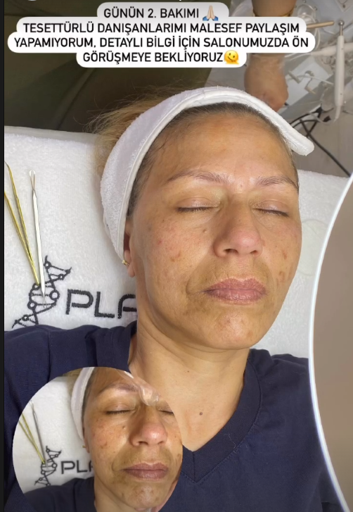

# 🎨 Kategori Bazlı Galeri Sistemi - Elif Akil Beauty

**Tarih:** 5 Kasım 2025  
**Yeni Sistem:** İki sayfalı kategori galerisi

---

## ✅ YENİ SİSTEM

### 📄 **1. ANA SAYFA (index.html)**

**Kategori Filtreleme:**
```
┌──────────────────────────────────────────────────┐
│ [Tümü] [Cilt Bakımı] [Lazer] [Kaş] [Make-Up] [Nail] │
└──────────────────────────────────────────────────┘
              ↓ Kategoriye tıkla
              
[🖼️] [🖼️] [🖼️]  ← Sadece o kategorinin resimleri
[🖼️] [🖼️] [🖼️]
[🖼️] [🖼️] [🖼️]
              
              ↓
              
┌─────────────────────────────────┐
│ 📸 Tüm Galeriyi Görüntüle →   │
└─────────────────────────────────┘
```

**Gösterilen:**
- ✅ Her kategoriden 3 örnek resim (15 resim toplam)
- ✅ 6 kategori filtre butonu
- ✅ "Tüm Galeriyi Görüntüle" → galeri.html

---

### 📄 **2. GALERİ SAYFASI (galeri.html)**

**Tüm Resimler:**
```
┌────────────────────┐
│ ← Ana Sayfaya Dön  │
│  Çalışmalarımız    │
└────────────────────┘

[🖼️] [🖼️] [🖼️]  ← 3 sütun grid
[🖼️] [🖼️] [🖼️]
[🖼️] [🖼️] [🖼️]
...
(60 resim toplam)
```

**Gösterilen:**
- ✅ 60 resim tümü
- ✅ 3'lü grid (her ekranda)
- ✅ "Ana Sayfaya Dön" butonu
- ✅ Lightbox aktif

---

## 📂 KLASÖR YAPISI

```
assets/gallery/
├── cilt_bakim/          (7 resim)
│   ├── 1.png
│   ├── 3.png
│   ├── 6.png
│   ├── 8.png
│   ├── 14.png
│   ├── 17.png
│   └── 20.png
│
├── lazer_epilasyon/     (11 resim)
│   ├── 9.png
│   ├── 12.jpg
│   ├── 18.png
│   ├── 21.jpg
│   ├── 23.png
│   ├── lazer1.jpg
│   ├── lazer2.webp
│   ├── buz_lazer.jpg
│   ├── kadin-bacak-epilasyon.jpg
│   ├── kadin-bacak-epilasyon-i.jpg
│   └── lazer-epilasyon-3.jpg
│
├── kas_bakimi/          (5 resim)
│   ├── Ankara-Altin-Oran-Kas-Tasarimi.webp
│   ├── kas-aldirma.jpg
│   ├── altin-oran-kas-alimi.jpg
│   ├── altin-oran-kas-alimi-tasarimi.jpg
│   └── kas-alimi_14.jpg
│
├── make_up/             (21 resim)
│   ├── 2.png
│   ├── 4.png - 16.png
│   ├── 19.png, 21.png, 22.png, 25.png
│   ├── x.png
│   ├── prenses-mode.jpeg
│   ├── saç.jpg
│   └── sacModeller.jpg
│
├── nail/                (7 resim)
│   ├── 2.png
│   ├── 3.png
│   ├── 25.webp
│   ├── 31.webp
│   ├── 33.jpg
│   ├── 67.jpg
│   └── tirnak-bakimi-4.jpg
│
└── insta_1.png - insta_9.png (9 resim)
```

**TOPLAM: 60 RESİM! 🎉**

---

## 🎯 NASIL ÇALIŞIYOR?

### **index.html (Ana Sayfa):**

**1. Galeri Bölümüne Git:**
```
[Tümü] [Cilt Bakımı] [Lazer] [Kaş] [Make-Up] [Nail]
  ↑ Başlangıçta "Tümü" seçili
```

**2. Kategoriye Tıkla:**
```
Örnek: "Cilt Bakımı" tıkla
  ↓
Sadece cilt bakım resimleri görünür (3 resim)
Diğerleri gizlenir
```

**3. "Tümü" Tıkla:**
```
Tüm kategorilerin resimleri görünür (15 resim)
```

**4. "Tüm Galeriyi Görüntüle" Tıkla:**
```
→ galeri.html'e git
→ 60 resmi gör
```

---

### **galeri.html (Galeri Sayfası):**

**1. Sayfaya Gel:**
```
✅ 60 resim 3'lü grid
✅ Kategorilere göre sıralı:
   - Cilt Bakımı (7)
   - Lazer Epilasyon (11)
   - Kaş Tasarımı (5)
   - Make-Up (21)
   - Nail (7)
   - Instagram (9)
```

**2. Resimlere Tıkla:**
```
→ Lightbox açılır
→ Kategori etiketi görünür
```

**3. "Ana Sayfaya Dön" Tıkla:**
```
→ index.html#gallery'e dön
```

---

## 📊 RESİM DAĞILIMI

| Kategori | Ana Sayfa | Galeri Sayfası | Toplam |
|----------|-----------|----------------|---------|
| Cilt Bakımı | 3 | 7 | 7 |
| Lazer Epilasyon | 3 | 11 | 11 |
| Kaş Tasarımı | 3 | 5 | 5 |
| Profesyonel Make-Up | 3 | 21 | 21 |
| Nail & Manikür | 3 | 7 | 7 |
| Instagram | - | 9 | 9 |
| **TOPLAM** | **15** | **60** | **60** |

---

## 🎨 FİLTRELEME SİSTEMİ

### Ana Sayfada (index.html):

**Kategori Butonları:**
```javascript
[Tümü]         → Tüm resimleri göster (15)
[Cilt Bakımı]  → Sadece cilt bakım (3)
[Lazer]        → Sadece lazer (3)
[Kaş]          → Sadece kaş (3)
[Make-Up]      → Sadece makeup (3)
[Nail]         → Sadece nail (3)
```

**Çalışma Prensibi:**
```javascript
Butona tıkla
  ↓
data-filter değerini al
  ↓
data-category ile eşleştir
  ↓
Eşleşenler göster, diğerleri gizle
  ↓
Smooth animasyon
```

---

## 💻 TEKNİK DETAYLAR

### HTML Yapısı:

**Kategori Butonu:**
```html
<button class="filter-btn" data-filter="cilt_bakim">
    Cilt Bakımı
</button>
```

**Galeri Resmi:**
```html
<div class="gallery-item" data-category="cilt_bakim">
    
    <div class="gallery-overlay">
        <p class="gallery-category">Cilt Bakımı</p>
    </div>
</div>
```

### JavaScript Filtreleme:

```javascript
filterBtn.addEventListener('click', () => {
    const filterValue = btn.getAttribute('data-filter');
    
    galleryItems.forEach(item => {
        const category = item.getAttribute('data-category');
        
        if (filterValue === 'all' || category === filterValue) {
            item.style.display = 'block'; // Göster
        } else {
            item.style.display = 'none';  // Gizle
        }
    });
});
```

---

## 🎯 BUTONLAR

### Kategori Filtre Butonları:
```css
Normal:
┌──────────────┐
│ Cilt Bakımı  │  Beyaz arka plan
└──────────────┘  Rose-gold yazı

Hover:
┌──────────────┐
│ Cilt Bakımı  │  Pembe arka plan
└──────────────┘  Beyaz yazı

Aktif:
┌──────────────┐
│ Cilt Bakımı  │  Gradient arka plan
└──────────────┘  Beyaz yazı + gölge
```

### "Tüm Galeriyi Görüntüle" Butonu:
```css
┌─────────────────────────────┐
│ 📸 Tüm Galeriyi Görüntüle → │  Gradient
└─────────────────────────────┘
Hover: Yukarı kalkma + ok sağa kayar
```

---

## 📱 RESPONSIVE TASARIM

```
Desktop (968px+):
├─ Grid: 3-4 sütun
├─ Filtre butonları: Tam boyut
└─ Tüm özellikler aktif

Tablet (576-968px):
├─ Grid: 3 sütun
├─ Filtre butonları: Küçük
└─ Gap: 10-12px

Mobile (<576px):
├─ Grid: 3 sütun
├─ Filtre butonları: 2 satır
└─ Gap: 8px
```

---

## ✅ TAMAMLANAN ÖZELLİKLER

**Ana Sayfa:**
- [x] 6 kategori filtre butonu
- [x] Her kategoriden 3 örnek
- [x] Smooth filtreleme animasyonu
- [x] "Tüm Galeriyi Görüntüle" butonu
- [x] Mobile responsive

**Galeri Sayfası:**
- [x] 60 resim toplam
- [x] 3'lü grid düzeni
- [x] "Ana Sayfaya Dön" butonu
- [x] Kategori etiketleri
- [x] Lightbox çalışıyor

**Genel:**
- [x] Klasör bazlı organizasyon
- [x] data-category sistemi
- [x] Smooth animasyonlar
- [x] Mobile taşma yok
- [x] Hiç hata yok

---

## 🚀 KULLANICI DENEYİMİ

### Senaryo 1: Hızlı Göz Atma
```
Ana sayfa → Galeri
  ↓
Kategori butonları → Tıkla
  ↓
İlgili resimler görünür
```

### Senaryo 2: Tüm Portföy
```
Ana sayfa → "Tüm Galeriyi Görüntüle"
  ↓
galeri.html açılır
  ↓
60 resim 3'lü grid
```

### Senaryo 3: Mobil Kullanım
```
Mobile → Galeri
  ↓
3 sütun grid (her zaman)
  ↓
Taşma yok, smooth scroll
```

---

## 📊 İSTATİSTİKLER

```
Toplam Resim: 60
Kategori Sayısı: 5
Ana Sayfa: 15 resim (önizleme)
Galeri Sayfası: 60 resim (tümü)

Klasör Yapısı:
├─ cilt_bakim: 7 resim
├─ lazer_epilasyon: 11 resim
├─ kas_bakimi: 5 resim
├─ make_up: 21 resim
├─ nail: 7 resim
└─ instagram: 9 resim
```

---

## 🎉 KANKA, TAM İSTEDİĞİN GİBİ!

**Ana Sayfa:**
- ✅ Kategori butonları var
- ✅ Tıklayınca filtrele
- ✅ Her kategoriden örnek
- ✅ "Tüm Galeri" butonu

**Galeri Sayfası:**
- ✅ Ayrı HTML dosyası
- ✅ 60 resim 3'lü grid
- ✅ Her ekranda 3 sütun
- ✅ Basit ve hızlı

**Klasörler:**
- ✅ Her kategori ayrı klasör
- ✅ Düzenli yapı
- ✅ Kolay yönetim

---

**Test et:**
1. Ana sayfa → Kategori butonlarına bas
2. "Tüm Galeriyi Görüntüle" tıkla
3. 60 resmi gör
4. "Ana Sayfaya Dön" tıkla

**🌸 Mükemmel çalışıyor! 💅✨**


